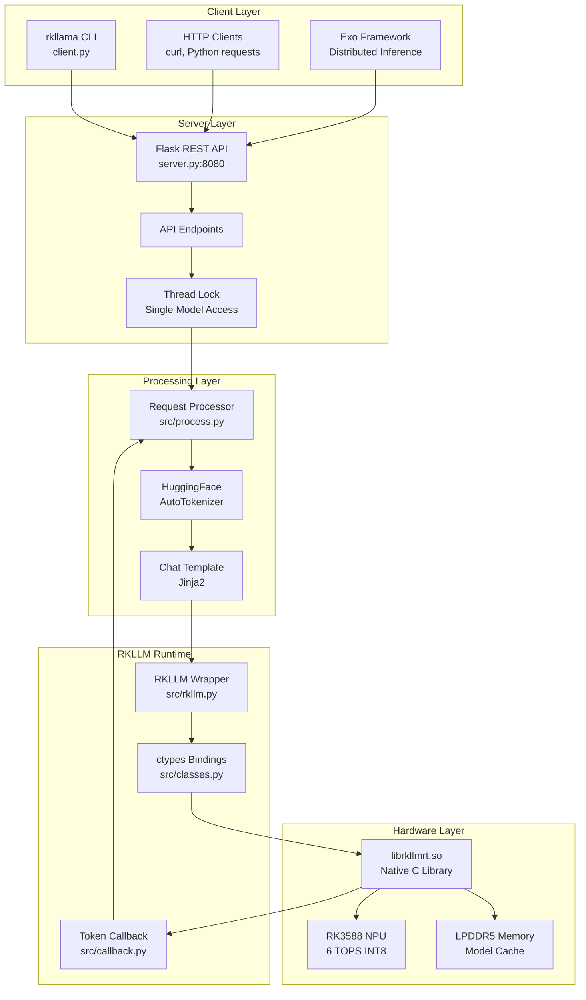
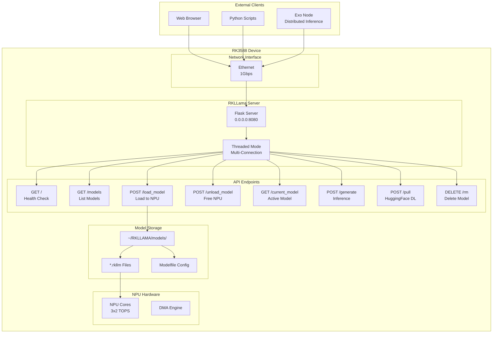
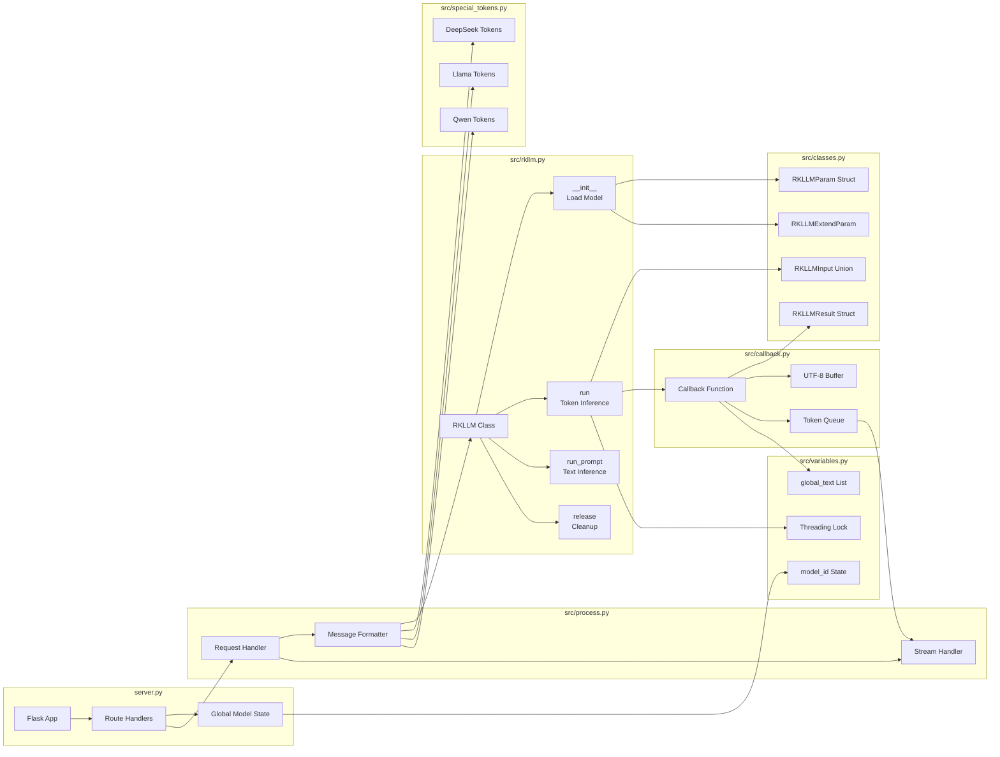
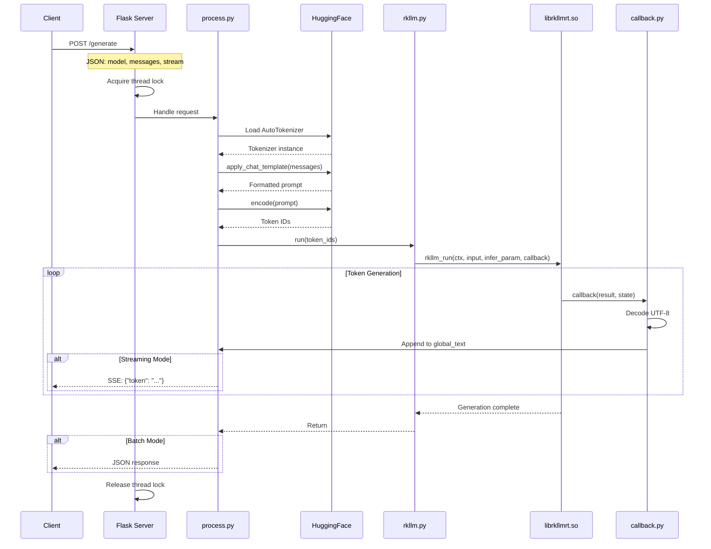
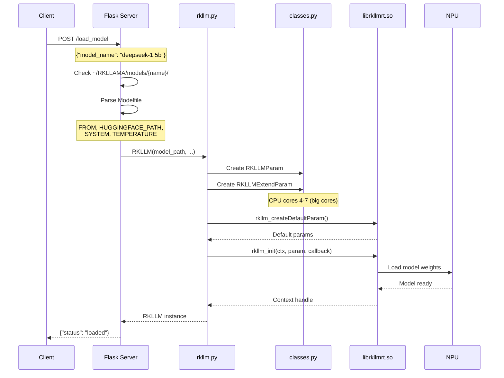
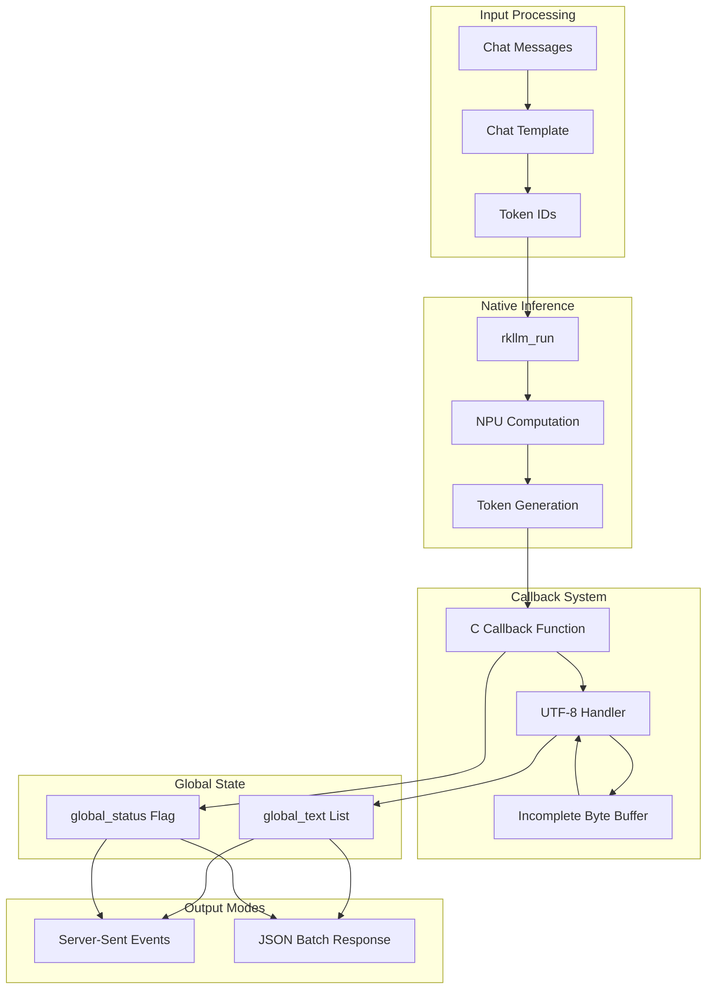
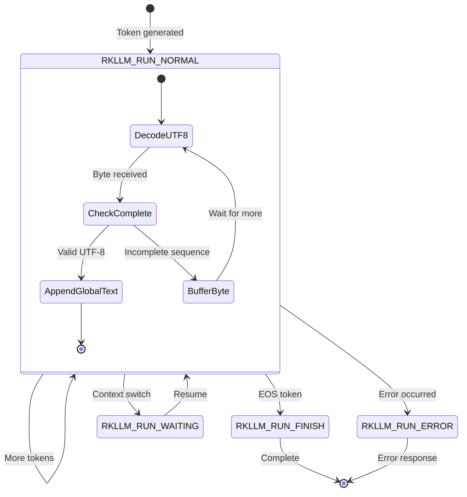
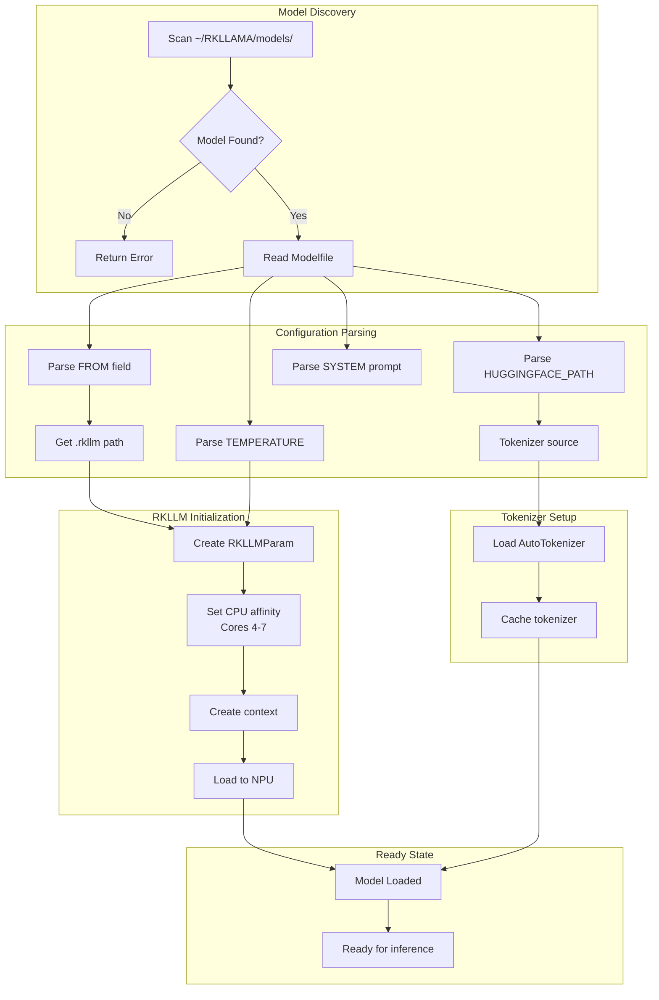

# Architecture Documentation

This document provides visual architecture documentation for RKLLama - the LLM inference server for Rockchip RK3588/RK3576 NPU.

## Table of Contents

1. [System Overview](#system-overview)
2. [Network Topology](#network-topology)
3. [Component Interaction](#component-interaction)
4. [Data Flow](#data-flow)
5. [Token Streaming Architecture](#token-streaming-architecture)
6. [Model Loading Pipeline](#model-loading-pipeline)

---

## System Overview



---

## Network Topology



---

## Component Interaction



---

## Data Flow

### Inference Request Flow



### Model Loading Flow



---

## Token Streaming Architecture



### Callback State Machine



---

## Model Loading Pipeline



---

## Configuration Reference

### Modelfile Format

```
FROM="model-name.rkllm"
HUGGINGFACE_PATH="org/repo-name"
SYSTEM="You are a helpful assistant."
TEMPERATURE=0.8
MAX_NEW_TOKENS=2048
```

### API Response Formats

**Streaming (SSE):**
```json
{"token": "Hello", "thinking": false}
{"token": " world", "thinking": false}
{"token": "", "finish": true, "tokens_per_second": 15.2}
```

**Batch:**
```json
{
  "response": "Hello world",
  "tokens_generated": 2,
  "tokens_per_second": 15.2
}
```

---

## File Structure

```
rkllama/
├── server.py              # Flask REST API server
├── client.py              # CLI client
├── rkllama.ini            # Configuration file
├── lib/
│   └── librkllmrt.so      # Native RKLLM runtime
├── src/
│   ├── rkllm.py           # RKLLM wrapper class
│   ├── classes.py         # ctypes struct definitions
│   ├── callback.py        # Token streaming callback
│   ├── process.py         # Request processing
│   ├── special_tokens.py  # Model-specific tokens
│   └── variables.py       # Global state
├── models/                # Model storage directory
│   └── {model_name}/
│       ├── Modelfile      # Model configuration
│       └── *.rkllm        # Model weights
└── documentation/
    └── api/               # API documentation
```
